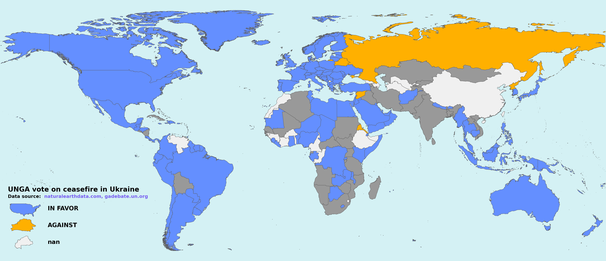
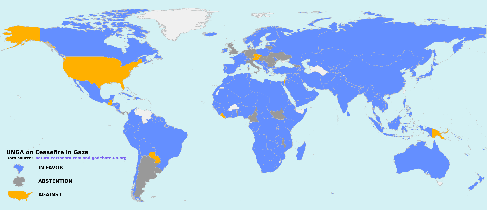

# Kaartmaker
Make world and regional labeled maps based on voting. Most commonly used for representing UN General Assembly votes.






### Secondary features

- Generate geojson files for specific regions :)

- Colors are colorblind friendly, selected from [here](https://davidmathlogic.com/colorblind) can also be reversed


## How To


### Donwload your geojson data

Maps (sovereignty, units, subunits, and disputed areas) can be downloaded from:
https://www.naturalearthdata.com/downloads/10m-cultural-vectors/10m-admin-0-details/

You can also download geojson files with the [download_geojson.sh](./download_geojson.sh) script in this repo.


### Using a comma separated list (CSV) file

To use `kaartmaker`, you'll need to provide a CSV file with columns called `NAME_EN` and `VOTE`. Valid votes are `YES`|`NO` or `AGAINST`|`ABSTENTION`|`IN FAVOR` Example when documenting :

```csv
NAME_EN,VOTE
Brazil,IN FAVOR
Czechia,AGAINST
Germany,ABSTENTION
```


# status
Mostly stable, but happy to take a look at Issues and Pull Requests :)
