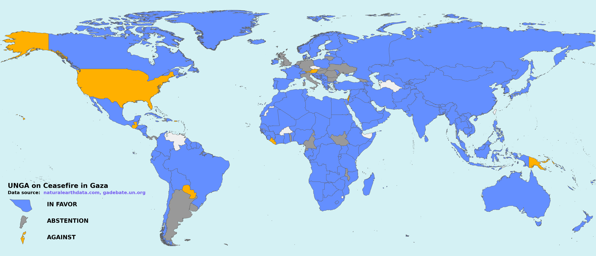

# Kaartmaker
Make world and regional labeled maps based on voting. Most commonly used for representing UN General Assembly votes.

```bash
kaartmaker -C ./kaartmaker/datasets/UN_general_assembly/russia_ceasefire/world_ukraine_votes.csv -t "UNGA vote on ceasefire in Ukraine" -s "gadebate.un.org"
```


```bash
kaartmaker -C ./kaartmaker/datasets/UN_general_assembly/israel_ceasefire/world_palestine_votes.csv -t "UNGA on Ceasefire in Gaza" -s "gadebate.un.org" -r world
```


```bash
kaartmaker -C ./kaartmaker/datasets/UN_general_assembly/israel_ceasefire/world_palestine_votes.csv -t "UNGA on Ceasefire in Gaza" -s "gadebate.un.org" -r europe
```


```bash
kaartmaker -C ./kaartmaker/datasets/UN_general_assembly/russia_ceasefire/world_ukraine_votes.csv -t "UNGA vote on ceasefire in Ukraine" -s "gadebate.un.org" -r europe
```


If you'd like to see more examples, please check them out [here](./examples/README.md).


### Secondary features

- Generate geojson files for specific regions :)

- Colors are colorblind friendly, selected from [here](https://davidmathlogic.com/colorblind) can also be reversed


## Installation

Make sure you have at least Python 3.12 and poetry installed, then you can do:

```bash
# install kaartmaker
poetry install
# open a virtual env 
poetry shell
```

## How To

```bash
kaartmaker --help
```


### Donwload your geojson data

Maps (sovereignty, units, subunits, and disputed areas) can be downloaded from:
https://www.naturalearthdata.com/downloads/10m-cultural-vectors/10m-admin-0-details/

You can also download geojson files with the [download_geojson.sh](./download_geojson.sh) script in this repo.


### Using a comma separated list (CSV) file

To use `kaartmaker`, you'll need to provide a CSV file with columns called `NAME_EN` and `VOTE`. Valid votes are `YES`|`NO` or `AGAINST`|`ABSTENTION`|`IN FAVOR` Example when documenting :

```csv
NAME_EN,VOTE
Brazil,IN FAVOR
Czechia,AGAINST
Germany,ABSTENTION
```


# status
Mostly stable, but happy to take a look at Issues and Pull Requests :)
