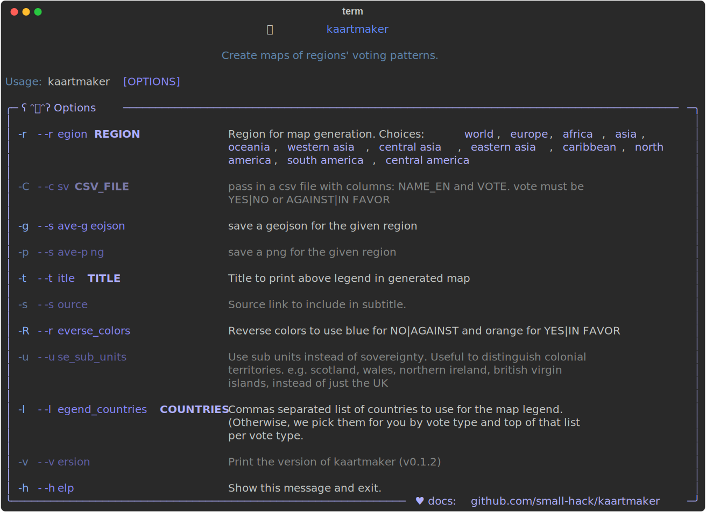

# Kaartmaker
<a href="https://github.com/small-hack/kaartmaker/releases">
  
</a>

Make world and regional labeled maps based on voting. Most commonly used for representing UN General Assembly votes.

```bash
kaartmaker -C ./kaartmaker/datasets/UN_general_assembly/russia_ceasefire/world_ukraine_votes.csv -t "UNGA vote on ceasefire in Ukraine" -s "gadebate.un.org"
```


```bash
kaartmaker -C ./kaartmaker/datasets/UN_general_assembly/israel_ceasefire/world_palestine_votes.csv -t "UNGA on Ceasefire in Gaza" -s "gadebate.un.org" -r world
```


```bash
kaartmaker -C ./kaartmaker/datasets/UN_general_assembly/israel_ceasefire/world_palestine_votes.csv -t "UNGA on Ceasefire in Gaza" -s "gadebate.un.org" -r europe
```


```bash
kaartmaker -C ./kaartmaker/datasets/UN_general_assembly/russia_ceasefire/world_ukraine_votes.csv -t "UNGA vote on ceasefire in Ukraine" -s "gadebate.un.org" -r europe
```


If you'd like to see more examples, please check them out [here](./examples/README.md).


* [Features](#features)
* [Installation](#installation)
    * [Prereqs](#prereqs)
    * [pipx (recommended for end users)](#install-with-pipx-recommended-for-end-users)
    * [pip (not recommended))](#install-with-pip)
    * [poetry (recommended for development)](#install-with-poetry-recommended-for-development)
* [How To](#how-to)
    * [Donwload your geojson data](#donwload-your-geojson-data)
    * [Using a comma separated list (CSV) file](#using-a-comma-separated-list-csv-file)
* [status](#status)


## Features

- Use your own csv datasets to generate maps for the world, or specific regions

- Generate geojson files for specific regions with your vote data :)

- Colors are colorblind friendly, selected from [here](https://davidmathlogic.com/colorblind) can also be reversed for vote types

- Use sovereignty (default) or subunits to get more granularity on countries e.g. Scotland, North Ireland, Wales, and Isle of Man distinguished from the United Kingdom


## Installation

#### Prereqs
- Python 3.12 or higher
- [pip], [pipx], or [poetry]

### Install with pipx (recommended for end users)

We recommend using [pipx] to install kaartmaker into an isolated python environment.

```bash
pipx install kaartmaker
```

### Install with pip
This will break your system packages on Debian.

```bash
pip install kaartmaker --break-system-packages
```

### Install with poetry (recommended for development)

Clone the repo and cd into the root directory of the repo, then run:

```bash
# install kaartmaker
poetry install

# open a virtual env and then you can run kaartmaker
poetry shell
```

## How To

```bash
kaartmaker --help
```



### Donwload your geojson data

Maps (sovereignty, units, subunits, and disputed areas) can be downloaded from:
https://www.naturalearthdata.com/downloads/10m-cultural-vectors/10m-admin-0-details/

You can also download geojson files with the [download_geojson.sh](./download_geojson.sh) or [download_geojson.py](./download_geojson.py) scripts in this repo.


### Using a comma separated list (CSV) file

To use `kaartmaker`, you'll need to provide a CSV file with columns called `NAME_EN` and `VOTE`. Valid votes are `YES`|`NO` or `AGAINST`|`ABSTENTION`|`IN FAVOR` Example when documenting :

```csv
NAME_EN,VOTE
Brazil,IN FAVOR
Czechia,AGAINST
Germany,ABSTENTION
```


# status
Mostly stable, but happy to take a look at Issues and Pull Requests :)

Please star the repo if you find it interesting!


<!--- ref links -->
[pipx]: https://github.com/pypa/pipx "pipx is a python installer that uses virtual environments"
[pip]: https://pip.pypa.io/en/stable/installation/ "default installer for python"
[poetry]: https://python-poetry.org/docs/#installation "development tool for python installations in virtual envs"
