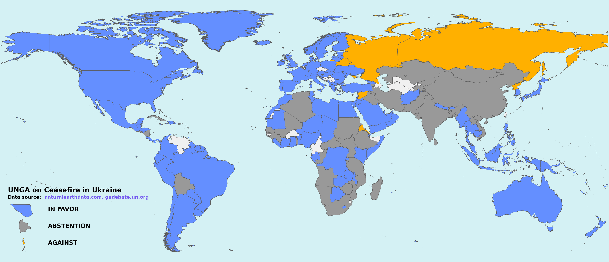

# Examples
Below you'll find examples of voting patterns illustrated using the `kaartmaker` script as well as the commands run to get them.

* [United Nations General Assembly vote on Israel Palestine War ceasefire](#united-nations-general-assembly-vote-on-israel-palestine-war-ceasefire)
    * [World](#world)
    * [Europe](#europe)
    * [Africa](#africa)
    * [Asia](#asia)
    * [South America](#south-america)
    * [Central America](#central-america)
    * [Caribbean](#caribbean)
    * [Oceania](#oceania)
* [United Nations General Assembly vote on Russia Ukraine War ceasefire](#united-nations-general-assembly-vote-on-russia-ukraine-war-ceasefire)
    * [World](#world-1)
    * [Europe](#europe-1)
    * [Africa](#africa-1)
    * [Asia](#asia-1)
    * [Oceania](#oceania-1)
    * [Caribbean](#caribbean-1)
    * [Central America](#central-america-1)
    * [South America](#south-america-1)

## United Nations General Assembly vote on Israel Palestine War ceasefire

<b>Date</b>: 12 December 2023 4:26 PM
<b>Data Source</b>: https://news.un.org/en/story/2023/12/1144717

<details>
    <summary>Resolution Text</summary>

<b>Protection of civilians and upholding legal and humanitarian obligations</b>

The General Assembly, 

Guided by the purposes and principles of the Charter of the United Nations, 

Recalling its resolutions regarding the question of Palestine, 

Recalling also all relevant Security Council resolutions, 

Taking note of the letter dated 6 December 2023 from the Secretary-General, under Article 99 of the Charter of the United Nations, addressed to the President of the Security Council,

Taking note also of the letter dated 7 December 2023 from the CommissionerGeneral of the United Nations Relief and Works Agency for Palestine Refugees in the Near East addressed to the President of the General Assembly,

Expressing grave concern over the catastrophic humanitarian situation in the Gaza Strip and the suffering of the Palestinian civilian population, and emphasizing that the Palestinian and Israeli civilian populations must be protected in accordance with international humanitarian law,

1. <i>Demands</i> an immediate humanitarian ceasefire;
   
2. <i>Reiterates</i> its demand that all parties comply with their obligations under international law, including international humanitarian law, notably with regard to the protection of civilians;
   
3. <i>Demands</i> the immediate and unconditional release of all hostages, as well as ensuring humanitarian access;

4. <i>Decides</i> to adjourn the tenth emergency special session temporarily and to authorize the President of the General Assembly at its most recent session to resume its meeting upon request from Member States.

</details>

### World

```bash
kaartmaker -C ./kaartmaker/datasets/UN_general_assembly/israel_ceasefire/world_palestine_votes.csv -t "UNGA on Ceasefire in Gaza" -s "gadebate.un.org" -r world
```


### Europe

```bash
kaartmaker -C ./kaartmaker/datasets/UN_general_assembly/israel_ceasefire/world_palestine_votes.csv -t "UNGA on Ceasefire in Gaza" -s "gadebate.un.org" -r europe
```


### Africa

```bash
kaartmaker -C ./kaartmaker/datasets/UN_general_assembly/israel_ceasefire/world_palestine_votes.csv -t "UNGA on Ceasefire in Gaza" -s "gadebate.un.org" -r africa
```


### Asia

```bash
kaartmaker -C ./kaartmaker/datasets/UN_general_assembly/israel_ceasefire/world_palestine_votes.csv -t "UNGA on Ceasefire in Gaza" -s "gadebate.un.org" -r asia -l "Indonesia,Israel,Georgia"
```


### South America

```bash
kaartmaker -C ./kaartmaker/datasets/UN_general_assembly/israel_ceasefire/world_palestine_votes.csv -t "UNGA on Ceasefire in Gaza" -s "gadebate.un.org" -r "south america"
```


### Central America

```bash
kaartmaker -C ./kaartmaker/datasets/UN_general_assembly/israel_ceasefire/world_palestine_votes.csv -t "UNGA on Ceasefire in Gaza" -s "gadebate.un.org" -r "central america"
```


### Caribbean

```bash
kaartmaker -C ./kaartmaker/datasets/UN_general_assembly/israel_ceasefire/world_palestine_votes.csv -t "UNGA on Ceasefire in Gaza" -s "gadebate.un.org" -r caribbean
```


### Oceania

```bash
kaartmaker -C ./kaartmaker/datasets/UN_general_assembly/israel_ceasefire/world_palestine_votes.csv -t "UNGA on Ceasefire in Gaza" -s "gadebate.un.org" -r oceania
```


## United Nations General Assembly vote on Russia Ukraine War ceasefire
<b>Date</b>: 2 March 2022
<b>Data Source</b>: https://news.un.org/en/story/2023/02/1133847
<b>Resolution Text</b>: See [resolution_text.pdf](../kaartmaker/datasets/UN_general_assembly/russia_ceasefire/resolution_text.pdf)


### World

```bash
kaartmaker -C ./kaartmaker/datasets/UN_general_assembly/russia_ceasefire/world_ukraine_votes.csv -t "UNGA vote on ceasefire in Ukraine" -s "gadebate.un.org"
```


### Europe

```bash
kaartmaker -C ./kaartmaker/datasets/UN_general_assembly/russia_ceasefire/world_ukraine_votes.csv -t "UNGA vote on ceasefire in Ukraine" -s "gadebate.un.org" -r europe
```


### Africa

```bash
kaartmaker -C ./kaartmaker/datasets/UN_general_assembly/russia_ceasefire/world_ukraine_votes.csv -t "UNGA vote on ceasefire in Ukraine" -s "gadebate.un.org" -r africa
```


### Asia

```bash
kaartmaker -C ./kaartmaker/datasets/UN_general_assembly/russia_ceasefire/world_ukraine_votes.csv -t "UNGA vote on ceasefire in Ukraine" -s "gadebate.un.org" -r asia
```


### Oceania

```bash
kaartmaker -C ./kaartmaker/datasets/UN_general_assembly/russia_ceasefire/world_ukraine_votes.csv -t "UNGA vote on ceasefire in Ukraine" -s "gadebate.un.org" -r oceania
```


### Caribbean

```bash
kaartmaker -C ./kaartmaker/datasets/UN_general_assembly/russia_ceasefire/world_ukraine_votes.csv -t "UNGA vote on ceasefire in Ukraine" -s "gadebate.un.org" -r caribbean
```


### Central America

```bash
kaartmaker -C ./kaartmaker/datasets/UN_general_assembly/russia_ceasefire/world_ukraine_votes.csv -t "UNGA vote on ceasefire in Ukraine" -s "gadebate.un.org" -r "central america"
```


### South America

```bash
kaartmaker -C ./kaartmaker/datasets/UN_general_assembly/russia_ceasefire/world_ukraine_votes.csv -t "UNGA vote on ceasefire in Ukraine" -s "gadebate.un.org" -r "south america"
```


